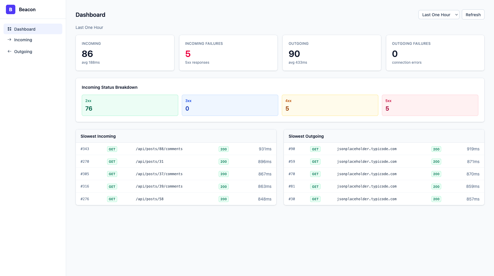
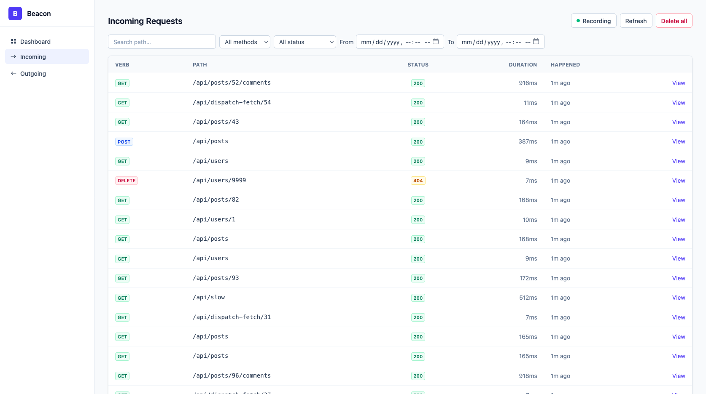
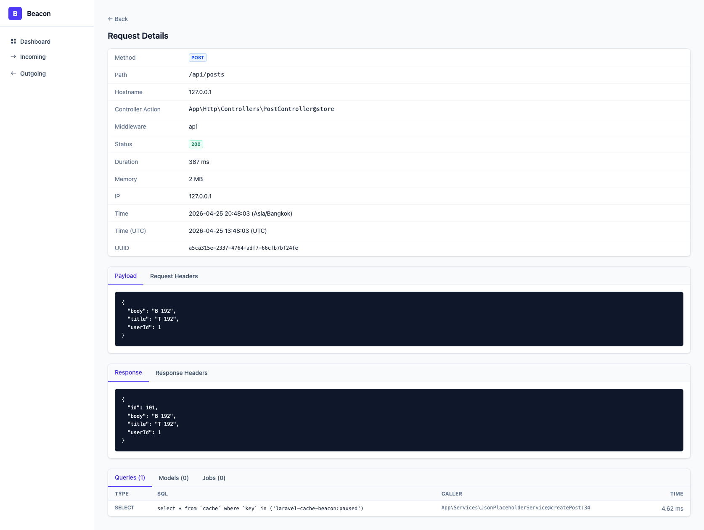
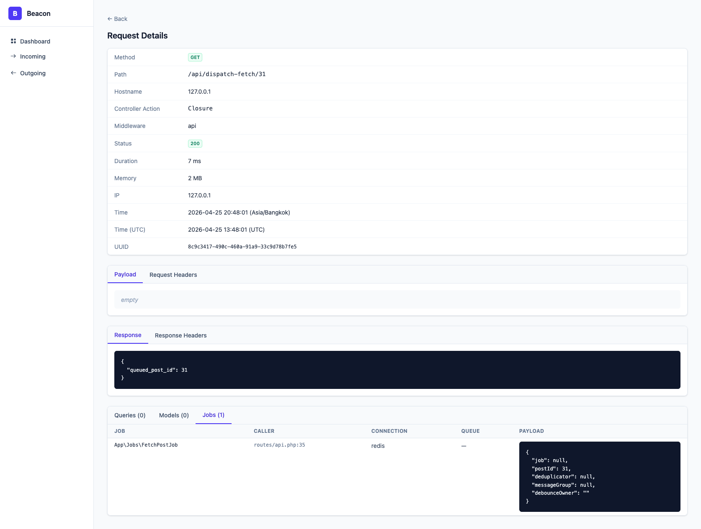
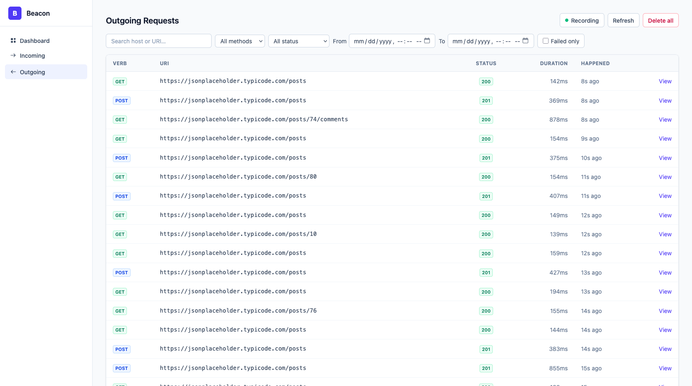
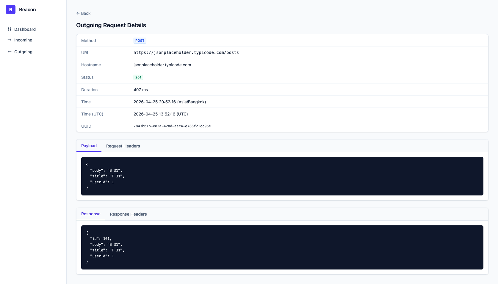

# Laravel HTTP Beacon

A lightweight, HTTP-focused observability package for Laravel. Beacon records every incoming HTTP request and every outgoing HTTP call, along with the queries, model events, and queued jobs they triggered, and serves them through a built-in Vue dashboard.

It is intentionally narrower than [Laravel Telescope](https://github.com/laravel/telescope) — only the parts most teams care about in production: HTTP traffic and the work that traffic kicked off.

## Why Beacon?

- **HTTP-first.** No watchers for things you rarely need in production (mail, cache, redis, views, dumps, ...). Just requests in, requests out, and what they did.
- **Filterable at scale.** Beacon stores queries, model touches, and job dispatches in normalized tables with composite indexes.
- **Caller everywhere.** Each captured query, model event, and dispatched job is tagged with the user-code call site (e.g. `App\Services\UserService@updateUser:14`), not just queries.
- **Modern stack.** Vue 3, Vite, Tailwind v4. Compiled assets ship with the package — no Node toolchain required in the consumer app.

## Features

- Incoming HTTP request capture (method, path, status, duration, memory, IP, headers, payload, response, controller action, middleware)
- Outgoing HTTP request capture (method, URI, status, duration, headers, payload, response, error)
- Per-request rollups: queries (with bindings), model touches (with diff), dispatched jobs (with payload)
- Caller stack capture for queries, models, jobs, **and outgoing HTTP calls** — `Class@method:line`
- Header and parameter redaction (case-insensitive headers, dot/wildcard parameter paths)
- Search + method + status-range + date-range + failed-only filters (date range is timezone-aware — browser local → UTC)
- Keyset pagination (`?before_id=N`)
- Pause / resume recording from the UI or via Artisan
- Bulk delete from the UI
- Retention pruning command (chunked `DELETE`)
- **Hard row caps** (`incoming.max_rows` / `outgoing.max_rows`) — oldest entries auto-trim FIFO with concurrency-safe locking
- **Configurable route middleware** — drop in your own auth gate via `beacon.middleware`
- Configurable sampling rate, body size limits, ignored hosts/paths/methods/status codes
- Dashboard with **selectable time windows** (Last One Hour / Today / Yesterday / This Week / This Month / Last Week / Last Month): counts, status buckets, slowest endpoints, failed outgoing
- UI assets served straight from `vendor/` — `composer update` ships new bundles, no `vendor:publish` follow-up

## Beacon vs Telescope


|                                      | Beacon                                                                        | Telescope                                  |
| ------------------------------------ | ----------------------------------------------------------------------------- | ------------------------------------------ |
| Incoming HTTP requests               | ✅                                                                             | ✅                                          |
| Outgoing HTTP client                 | ✅                                                                             | ✅                                          |
| Queries (with bindings + caller)     | ✅                                                                             | ✅                                          |
| Model events (with diff)             | ✅                                                                             | ✅                                          |
| Job dispatches                       | ✅                                                                             | ✅                                          |
| Caller (file:line + `Class@method`)  | ✅ queries, models, jobs, outgoing                                             | ⚠️ queries only                            |
| Authorization gates                  | ❌                                                                             | ✅                                          |
| Mail / Notifications                 | ❌                                                                             | ✅                                          |
| Cache / Redis                        | ❌                                                                             | ✅                                          |
| Logs / Exceptions                    | ❌                                                                             | ✅                                          |
| Dumps (`dd` / `dump`)                | ❌                                                                             | ✅                                          |
| Schedule / Commands                  | ❌                                                                             | ✅                                          |
| Views                                | ❌                                                                             | ✅                                          |
| Normalized DB tables (indexed)       | ✅                                                                             | ❌ single JSON entries                      |
| Indexed filter on method/status/date | ✅                                                                             | ❌ JSON column scans                        |
| Built-in dashboard widgets           | ✅ counts, buckets, slowest, time-window presets                               | ⚠️ basic listing only                      |
| UI stack                             | Vue 3 + Tailwind v4                                                           | Vue 2 + Bootstrap                          |
| Auth gate by default                 | ❌ `beacon.middleware = ['web']` (add `'auth'` to lock down)                   | ✅ `Gate::define('viewTelescope', ...)`     |


If you need a kitchen-sink debug tool in development, Telescope is the better fit. If you want production-grade HTTP traffic observability with fast filtering and predictable storage, use Beacon.

## Requirements

- PHP 8.1+
- Laravel 10, 11, 12, or 13
- MySQL, Postgres, or SQLite

| Laravel | PHP   |
| ------- | ----- |
| 10.x    | 8.1+  |
| 11.x    | 8.2+  |
| 12.x    | 8.2+  |
| 13.x    | 8.3+  |

## Installation

```bash
composer require tintaungkhant/laravel-http-beacon
```

Run the install command — it publishes the config and the migrations, then run the migration:

```bash
php artisan beacon:install
php artisan migrate
```

Open `/beacon` in your browser. UI assets are served by the package itself — no `vendor:publish --tag=beacon-assets` step. `composer update` is the only thing you need to run when a new version ships, and the bundle URL carries a cache-buster so browsers pick up the new build automatically.

## Configuration

After install, the config lives at `config/beacon.php`. The most-used keys:

```php
return [
    'enabled' => env('BEACON_ENABLED', true),

    'storage' => [
        'connection' => env('DB_CONNECTION', 'mysql'),
    ],

    'sampling_rate' => (float) env('BEACON_SAMPLING_RATE', 1.0), // 0.1 = 10% of traffic

    // Middleware applied to every Beacon route (dashboard view + JSON API).
    // Add an auth gate here, e.g. ['web', 'auth', 'can:viewBeacon'].
    'middleware' => ['web'],

    'redact' => (bool) env('BEACON_REDACT', true),

    'hidden_headers' => [
        'authorization', 'cookie', 'set-cookie', 'x-api-key', 'x-csrf-token',
    ],

    'hidden_parameters' => [
        'password', 'password_confirmation', 'token', 'secret', '_token',
    ],

    'incoming' => [
        'enabled' => true,
        'body_size_limit_kb' => 64,
        'max_rows' => null,            // null/0 = unlimited; otherwise oldest rows are auto-trimmed FIFO
        'only_paths' => [],            // ['api/*'] to record only API routes
        'ignore_paths' => ['beacon*', 'horizon*', 'telescope*', '_ignition*'],
        'ignore_methods' => [],
        'ignore_status_codes' => [],
    ],

    'outgoing' => [
        'enabled' => true,
        'body_size_limit_kb' => 64,
        'max_rows' => null,            // null/0 = unlimited; same FIFO trim behavior
        'ignore_hosts' => [],          // ['*.amazonaws.com']
    ],

    'collect' => [
        'queries' => true,
        'models' => true,
        'jobs' => true,
        'memory' => true,
        'model_actions' => ['created', 'updated', 'deleted', 'restored', 'retrieved'],
        'max_queries_per_request' => null, // 0 / null = unlimited
    ],

    'retention' => [
        'hours' => (int) env('BEACON_RETENTION_HOURS', 168), // 7 days
        'chunk_size' => 1000,
    ],
];
```

Hidden parameter paths support dot notation and wildcards: `user.password`, `tokens.*.value`.

## Artisan Commands

```bash
php artisan beacon:install   # publish config + migrations + assets, then migrate
php artisan beacon:pause     # stop recording (cache flag, persists across requests)
php artisan beacon:resume    # resume recording
php artisan beacon:clear     # truncate beacon_incoming_requests + beacon_outgoing_requests
php artisan beacon:prune     # delete entries older than retention.hours
php artisan beacon:prune --hours=24      # override retention
php artisan beacon:prune --dry-run       # count without deleting
```

The same pause / resume / clear actions are available from the dashboard header.

Schedule pruning with your application's scheduler:

```php
// routes/console.php
use Illuminate\Support\Facades\Schedule;

Schedule::command('beacon:prune')->daily();
```

## Authentication

Beacon defaults to `'middleware' => ['web']`, which gives you sessions and CSRF but **no auth gate**. For production, add your own gate via the same config key:

```php
// config/beacon.php
'middleware' => ['web', 'auth', 'can:viewBeacon'],
```

…and define the gate however you normally would:

```php
// app/Providers/AppServiceProvider.php
Gate::define('viewBeacon', fn ($user) => in_array($user->email, ['ops@example.com']));
```

Or just disable Beacon entirely in production:

```bash
# .env
BEACON_ENABLED=false
```

A built-in gate is on the roadmap.

## Testing

```bash
composer install
composer test       # phpunit
vendor/bin/phpstan  # level 5 with larastan
```

## Screenshots

### Dashboard

24-hour aggregation: incoming + outgoing volumes, failure counts, status breakdown, slowest endpoints (clickable through to detail).



### Incoming Requests

List view with search, method, status range, date range, and clickable rows. Pause / resume / delete-all in the header.



### Incoming Request Detail

Full request payload, headers, response, plus the queries / models / jobs that ran during the request — each tagged with the user-code caller.





### Outgoing Requests

List view with the `Failed only` toggle for connection errors.



### Outgoing Request Detail

URI, status, duration, request payload, response, and headers — same redaction rules as incoming.



## License

The MIT License (MIT). See [LICENSE](LICENSE).
